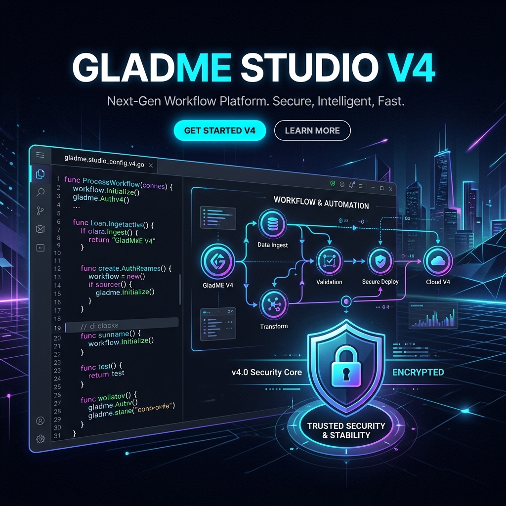
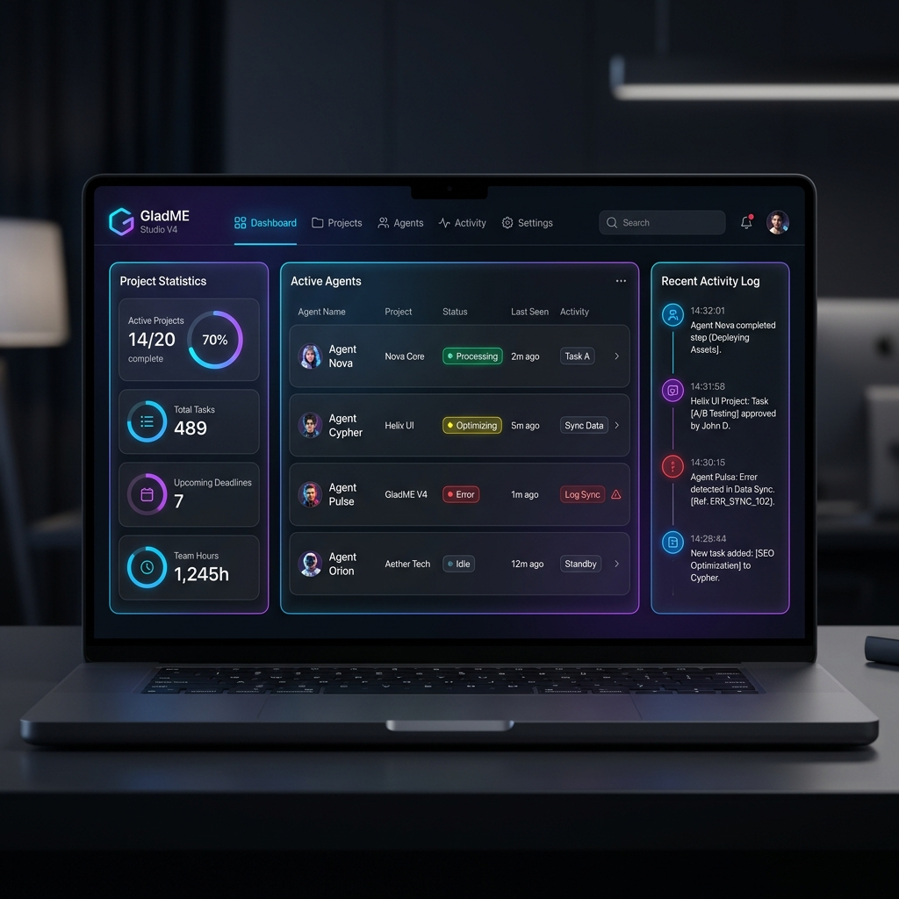
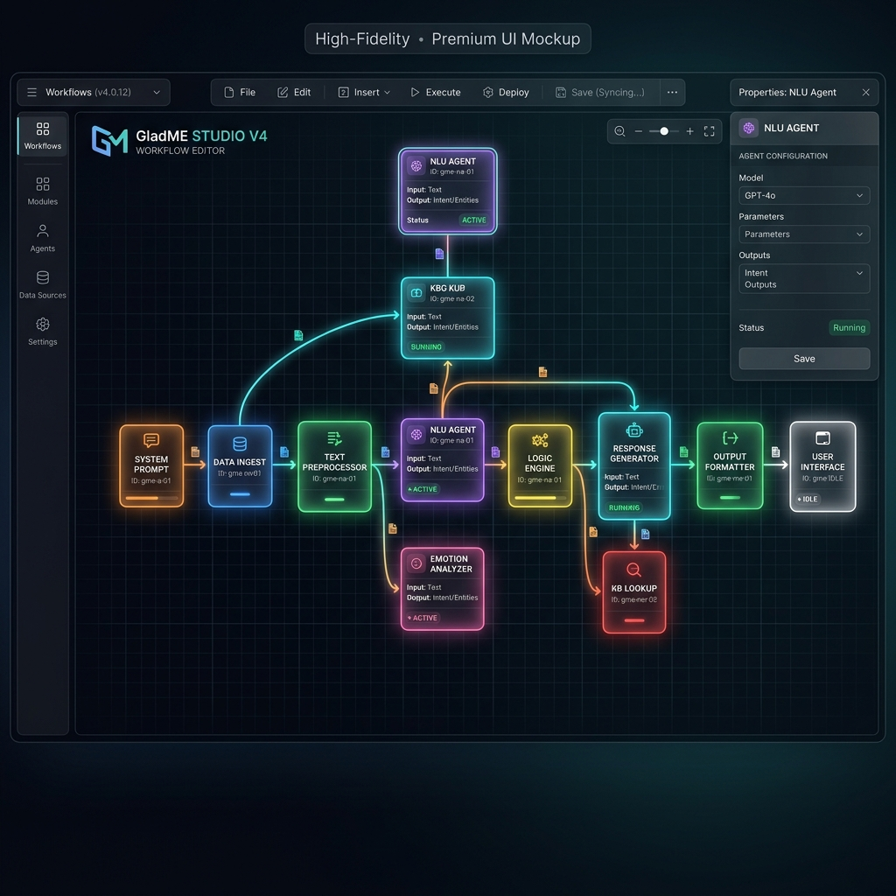
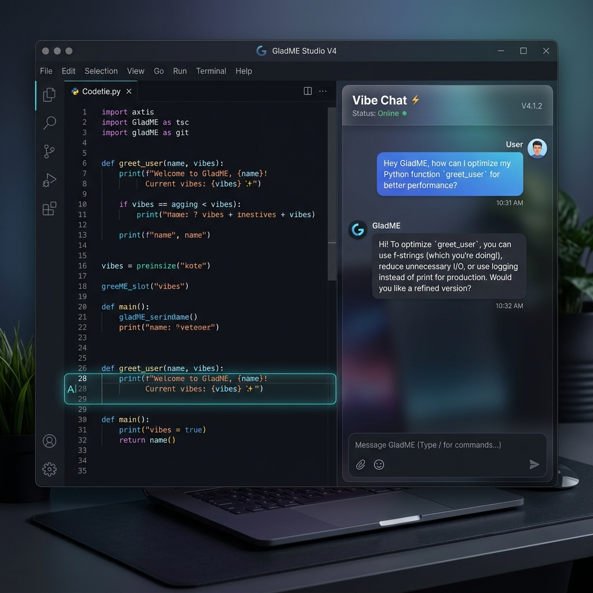
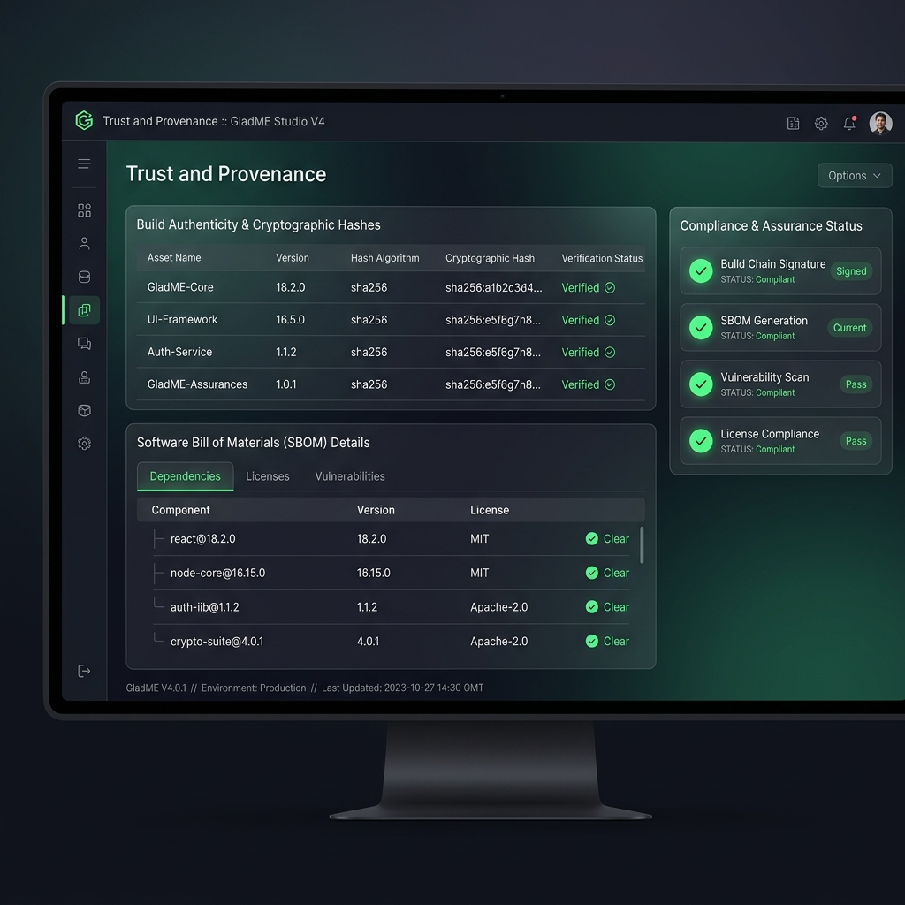

# GladME Studio V4 🚀

**The Next Generation Agentic IDE for Intelligent Software Engineering**

GladME Studio V4 is a high-fidelity, production-ready Agentic Integrated Development Environment. It automates the software development lifecycle by integrating multi-modal AI agents with a secure, containerized execution environment.



## 🌟 Key Features

### 1. Multi-Modal AI Orchestration
*   **Intelligent Routing:** Automatically switches between Ollama (Local), OpenAI (GPT-4o), and Anthropic (Claude 3.5 Sonnet) based on availability and task complexity.
*   **Vibe Coding:** A persistent, context-aware chat interface that allows you to "vibe" with your code—refactoring, debugging, and evolving projects in real-time.

### 2. Secure Execution Sandbox
*   **Docker Isolation:** All generated code and tests run within a secure `gladme-runner` container, protecting your host machine.
*   **Automated Testing:** Integrated Pytest suite with real-time coverage reporting and failure diagnostics.

### 3. Visual Engineering
*   **Interactive Workflow Mapping:** Visualize your project architecture and data flow using React Flow.
*   **Monaco Editor Integration:** Industry-standard code editing with syntax highlighting and intelligent completions.

### 4. Trust & Compliance
*   **Automated SBOM:** Generates a Software Bill of Materials for every project version.
*   **Provenance Tracking:** Cryptographic hashing of artifacts (Goal, Logic, Plan, Code) to ensure integrity and compliance.

## 🏗️ Architecture

- **Backend:** FastAPI (Python 3.12+), SQLAlchemy (ORM), Docker SDK, SlowAPI (Rate Limiting).
- **Frontend:** React 18 (Vite), Tailwind CSS, Monaco Editor, React Flow, Recharts.
- **Protocol:** Native Support for **Model Context Protocol (MCP)**.

## 🚀 Installation & Setup

### Prerequisites
- [Python 3.12+](https://www.python.org/downloads/)
- [Node.js 18+](https://nodejs.org/)
- [Docker Desktop](https://www.docker.com/products/docker-desktop/)
- [Ollama](https://ollama.com/) (Optional)

### Step 1: Clone & Environment Setup
```bash
git clone https://github.com/thapaprogress/GladMe-V4.git
cd GladMe-V4
```

### Step 2: Backend Configuration
```bash
cd backend
python -m venv venv
source venv/bin/activate  # Windows: .\venv\Scripts\activate
pip install -r requirements.txt

# Configure environment
cp .env.example .env
# Open .env and add your JWT_SECRET and LLM API keys
```

### Step 3: Docker Sandbox Initialization
```bash
cd backend/sandbox
docker build -t gladme-runner:latest -f Dockerfile.runner .
```

### Step 4: Frontend Installation
```bash
cd ../../frontend
npm install
```

## 🏃 Running the Application

### Option A: One-Click Launch (Windows)
Simply double-click the `start.bat` file in the root directory. It will automatically start both the Backend and Frontend servers.

### Option B: Manual Launch
**Terminal 1 (Backend):**
```bash
cd backend
source venv/bin/activate
python main.py
```

**Terminal 2 (Frontend):**
```bash
cd frontend
npm run dev
```

Visit: `http://localhost:5173` (or the port shown in your terminal).

## 📸 Screenshots

| Dashboard | Visual Workflow |
| :---: | :---: |
|  |  |

| Vibe Chat | Trust & Provenance |
| :---: | :---: |
|  |  |

> *Note: Please ensure you place actual screenshots in the `screenshots/` directory for them to render correctly.*

## 📄 Documentation
- [Improvement Report (PDF)](v4_improvement.pdf)
- [V4 Evolution Overview](improvement.md)
- [Developer Walkthrough](WALKTHROUGH.md)

---

Built with ❤️ by the GladME Team.
For more information, visit [GladMe.dev](https://gladme.dev).
